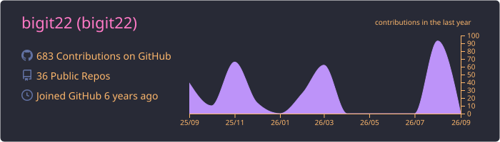

# Hi! I'm Yaroslav 👋

Backend Developer based in Novosibirsk, Russia

- 🔭 Currently developing [YouMySoul](https://github.com/YouMySoul) and [Yazio Nutrition Integrator](https://github.com/bigit22/YazioNutritionIntegrator)
- 🌱 Exploring: Asynchronous Python, Microservices, and DevOps
- 💬 Tech support & consultation: FastAPI, PostgreSQL, Docker
- 📫 Contact me: [Telegram](https://t.me/smbdinsociety) | [E-mail](mailto:koresh.yar@mail.ru) (Alternative: https://t.me/smbdinsociety / koresh.yar@mail.ru)

## 🛠️ Skills & Technologies

## 🌐 Languages

## 📈 GitHub Stats

## 📂 Featured Projects

- [Yazio Nutrition Integrator](https://github.com/bigit22/YazioNutritionIntegrator) `v0.1.0` — A Telegram bot that analyzes food photos using Google Gemini and automatically syncs logs to the Yazio food diary. Built with FastAPI, aiogram, and PostgreSQL.
- [YouMySoul](https://github.com/YouMySoul) — Backend development for a modern dating application powered by FastAPI.

## 🏆 Achievements

